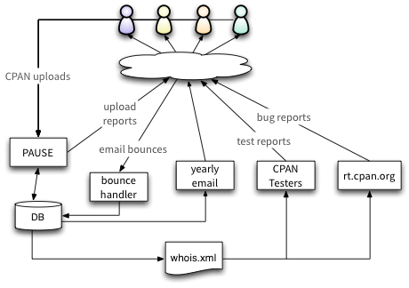

# CPAN email testing

This document proposes some changes to the existing PAUSE and CPAN infrastructure
to keep track of whether CPAN authors' email addresses are good or bad.

Variants of this idea have been mooted many times. This proposal started with
a discussion between NEILB and ANDK at the London Perl Workshop 2013.
That was followed up by a discussion at the Perl QA Hackathon 2014.

Participants: ANDK BARBIE BOOK DAGOLDEN ETHER NEILB RJBS

## Background

When you create a PAUSE account you're given a unique 'PAUSE id'; mine is NEILB.
Everyone with a PAUSE account gets a CPAN email email address, which is your pause id `@cpan.org`.
So my CPAN email address is `neilb@cpan.org`.
When you sign up for PAUSE you have to give a personal email address;
email sent to your CPAN email address is forwarded to your personal email address.

This email address is the default way to contact a CPAN author. It is used for at least the following:

 * PAUSE sends progress reports to this address when you upload distributions to CPAN (via PAUSE).
 * CPAN Testers sends information about failing test reports to your email address.
 * RT notifies you via email when someone submits a new bug for one of your distributions.
 * Others?

## The problem

People sometimes change their personal email addresses.
If they're still active CPAN authors then they're likely to update PAUSE
with the new email address, becaue they want to continue receiving
PAUSE's reports.

But if people lose interest in Perl and move on, then they often forget to update PAUSE with
a new email address. If their old email address is no longer active, then email to their CPAN
email address starts bouncing.

This can be a pain when wanting to contact a module author to ask for co-maint so you can release
bug fixes or enhancements. *other pain points?*

CPAN Testers already tracks this with the [missing in action](http://stats.cpantesters.org/missing.html) list.

A more generalised ecosystem-wide solution will enable

 * The PAUSE admins to make more informed decisions.
 * CPAN Testers to not bother sending reports to known bad addresses.
 * PAUSE to tell users their contact email address is bad, if they login to PAUSE.
 * Volunteers to try and track down MIA CPAN Authors, either to get their forwarding address updated,
   or to have their dists marked for HANDOFF or ADOPTME.
 * Us to identify dists that are probably no longer being maintained, and pre-emptively
   choose to do something about that.

# Proposed solution

The following changes will allow us to keep track of the goodness of CPAN email addresses:

 * PAUSE's database schema updated to record whether each user's contact email address is good.
 * When PAUSE, CPAN Testers and RT send email to a CPAN author, the header will be changed to direct
   bounces to a CPAN email bounce handler.
 * The bounce handler will update PAUSE's database when a hard bounce is received.
 * We will send CPAN authors a yearly email giving them useful information and telling them about
   any issues they need to sort out.
 * PAUSE will refuse uploads from authors with bad email addresses - the email reports would just bounce after all.
 * The PAUSE web interface will tell user's if their email address is bad, and PAUSE admins will also be
   able to see this.
 * The relevant PAUSE export files will include the information about liveness of each user's email address.

How the pieces fit together:

> 

The following sections describe each of the above points in more detail.

## PAUSE schema changes

quick thoughts - not suggesting we have all these, just brain-dumping out loud:

 * state: confirmed good, claimed good(?), presumed good, presumed bad, soft-bounce(?)
 * boolean: opt-in for yearly email (default: true, see question in Yearly email section below)
 * date of most recent yearly email
 * date of most recent bounce

If we get a soft bounce, should we record that such that we'll retry sooner than a year?
And N repeated soft bounces treated as a hard bounce, or just record and present it as such?

## Email headers

RJBS

## Email bounce handler

RJBS

## Yearly email

 * We'll only send the email to people who've uploaded something. That's roughly 6,000 of the 11,000 users.
 * That's about 16 emails per day, or 120 per week.
 * Start by sending a small trickle, as we'll need to debug / tune the system.
 * A *short* email with a summary of your information, and a list of things you could sort out,
   and links to the places where you can sort them out.
 * Also a good place to tell people about changes in the toolchain etc.
 * Should we let people opt out of the email? It would be good if we could make it part of the T's & C's
   of PAUSE (ha!) that you'll receive one such email per year. Rick?
 * Worth having a link in saying "please click to confirm you received this"?
   Then we know it's not been spam filtered. Most people won't click it though. If we have a link
   "See your CPAN dashboard" or somesuch, then we can track of that, maybe.
 * Synchronise this with the scheduled purging of authors' directories. The email would tell you that
   in 72 hours N old tarballs will be purged. Talk to HAARG.

## PAUSE interface changes

 * If your email address is bad, flag this when you login and ask prompt for a new email address,
   or to confirm that it's good.
 * PAUSE admin pages should show the state of a user's email address
 * Uploads refused if email address is presumed bad.

## Changes to PAUSE export files

00whois.xml at least has the email state

## Other changes

 * MetaCPAN and search.cpan.org could visually highlight MIA authors
 * The adoption list could give a +1 on a dist's adoption score for MIA authors

## Misc

Need to think about the email volume implications, as the PAUSE email gets routed through develooper.
PAUSE is sending more email, but CPAN Testers and RT will be sending less email. Net effect...?

